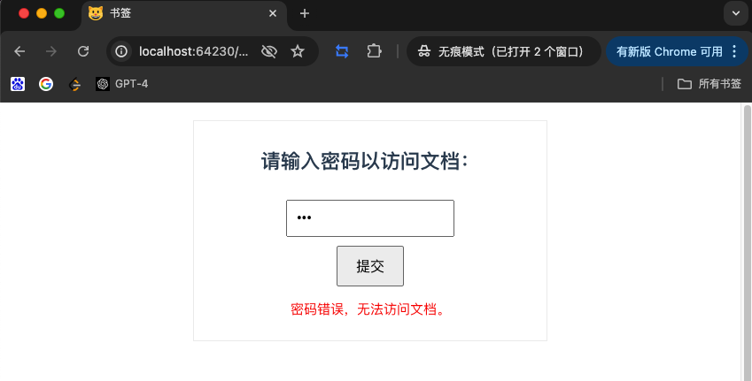

# docsify-auth
a auth pulign for docsify



## Usage

1. Configure docsify-auth:(配置)

    ```html
    <script>
    window.$docsify = {
      // auth
      auth: {
        enable: true, // 是否开启
        use: "sha256",
        password: "8d969eef6ecad3c29a3a629280e686cf0c3f5d5a86aff3ca12020c923adc6c92", // md5密码
        title: "请输入密码以访问文档：", // 设置标题
        paths: ["^/bookmark"] // 需要认证的路径，支持正则表达式匹配
      }
    }
    </script>
    ```

2. Insert script into docsify document:

    ```html

    <!-- body -->
    <script src="https://cdn.jsdelivr.net/npm/js-sha256@0.9.0/build/sha256.min.js"></script>
    <script src="https://cdn.jsdelivr.net/npm/docsify-auth@1.2.0/dist/docsify-auth.min.js"></script>
